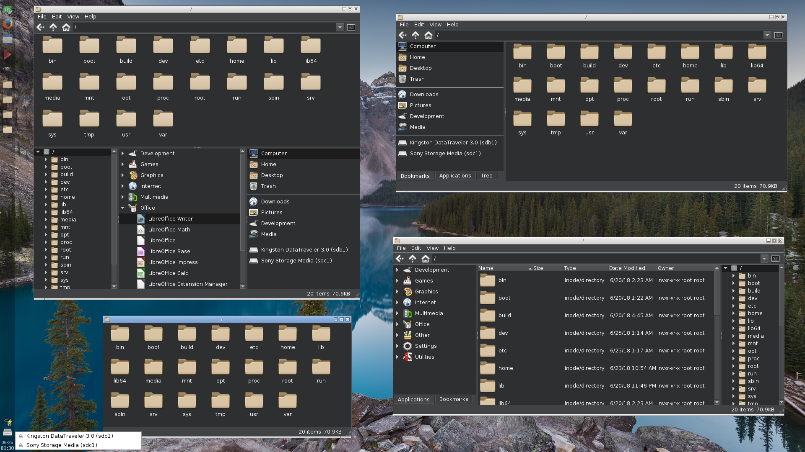

[](https://travis-ci.org/rodlie/qtfm)



Lightweight file manager using Qt.

 * Desktop (theme/applications/mime) integration
 * Customizable interface
 * Powerful custom command system
 * Customizable key bindings
 * Drag & drop functionality
 * Tabs
 * Udisks device support

### qtfm-open


A simple application launcher for use in Fluxbox, Openbox and other window managers.

#### Fluxbox

Open ``~/.fluxbox/keys`` and find the line starting with ``Mod1 F2``, replace existing launcher ``fbrun`` with ``qtfm-open``.
```
# open a dialog to run programs
Mod1 F2 :Exec qtfm-open
```

#### Openbox

Open ``~/.config/openbox/rc.xml`` and find the line line ``<!-- Keybindings for running applications -->``. Then add:

```
  <keybind key="A-F2">
    <action name="Execute">
      <command>qtfm-open</command>
    </action>
  </keybind>
```


## Links

 * [Releases](https://github.com/rodlie/qtfm/releases)
 * [Milestones](https://github.com/rodlie/qtfm/milestones)
 * [Issues](https://github.com/rodlie/qtfm/issues)
 * [Slackware](https://slackbuilds.org/repository/14.2/system/qtfm/)
 * [Arch Linux](https://aur.archlinux.org/packages/qtfm/)
 * [Gentoo](https://packages.gentoo.org/packages/x11-misc/qtfm)
 
## Build

Download the latest [release](https://github.com/rodlie/qtfm/releases), then make sure you have the required dependencies.

* Requires [Qt](http://qt.io) 4/5 development files
* Requires [file](http://darwinsys.com/file/) development files **if using Qt 4**
* Requires [hicolor-icon-theme](https://www.freedesktop.org/wiki/Software/icon-theme/) at run time
* Optional [udisks](https://www.freedesktop.org/wiki/Software/udisks/) at run time
* Optional [tango-icon-theme](http://tango.freedesktop.org) (or similar) at run time

Download and extract:
```
tar xvf qtfm-VERSION.tar.gz
cd qtfm-VERSION
```

Or use git:
```
git clone https://github.com/rodlie/qtfm
cd qtfm
```

Now you just need to build it:

```
mkdir build && cd build
qmake CONFIG+=release ..
make
```

You can run the binary ``fm/qtfm`` or install to ``/usr/local``:
```
sudo make install
```

## Packaging

Same as above, but you should use ``PREFIX=`` and ``INSTALL_ROOT=``.

Example:

```
mkdir build && cd build
qmake CONFIG+=release PREFIX=/usr ..
make -jX
make INSTALL_ROOT=/package_temp_path install
```
```
package
├── etc
│   └── xdg
│       └── autostart
│           └── qtfm-tray.desktop
└── usr
    ├── bin
    │   ├── qtfm
    │   ├── qtfm-open
    │   └── qtfm-tray
    └── share
        ├── applications
        │   └── qtfm.desktop
        └── doc
            └── qtfm-6.1.0
                ├── LICENSE
                └── README.md
```
* You can change the doc location with ``DOCDIR=``, default is ``PREFIX/share/doc``.

## Related

 * [Power Dwarf](https://github.com/rodlie/powerdwarf) : Desktop Independent Power Manager
