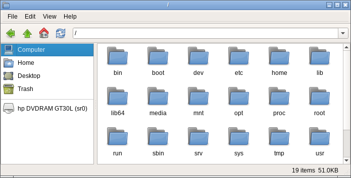

QtFM, originally created by [Wittfella](http://www.qtfm.org/) in 2010, and further developed by [Michal Rost](http://qt-apps.org/content/show.php/QtFM?content=158787) in 2012 has found a new home. This project [continues](https://github.com/rodlie/qtfm/compare/cea6fbacc6ebb52032077bea03b2891a67f85c3f...master) from the v5.9 source code released on qt-apps.org in 2013.

## Links

 * [Releases](https://github.com/rodlie/qtfm/releases)
 * [Milestones](https://github.com/rodlie/qtfm/milestones)
 * [Issues](https://github.com/rodlie/qtfm/issues)
 
